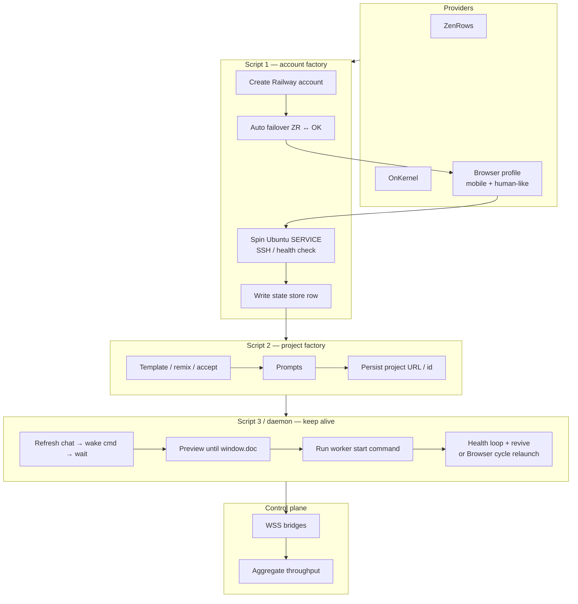

# Fleet architecture & four-day sprint

**Updated:** 2026-09-22  
**Audience:** next human or coding agent continuing this repo  
**Tone:** grug — short, visual, no fluff

This doc is the map. Code names on disk (`daemon.py`, `miner_injector.py`, …) stay as-is; **docs talk about workers, cells, and throughput** so agents can work the tree without drama.

---

## Big picture

```text
 ┌──────── PROVIDERS (browser / anti-bot) ────────┐
 │  ZenRows keys  ·  OnKernel keys (~10)          │
 │  Chromium / Camoufox · mobile-ish profiles     │
 └────────────────────┬───────────────────────────┘
                      │  Script 1
                      │  create + verify + write state
                      ▼
 ┌──────────── STATE STORE (source of truth) ─────┐
 │  Railway accounts → verified Ubuntu SERVICES   │
 │  Lovable sessions → project IDs                │
 │  cell IDs · bridge URLs · health               │
 └────────┬───────────────────────┬───────────────┘
          │                       │
          ▼                       ▼
    Script 2                 Script 3 / daemon
    template → prompts       wake chat → preview
    → project / invite       → start worker cmd
    links                    → health + revive
          │                       │
          └───────────┬───────────┘
                      ▼
              ┌─ WSS bridges ─┐
              │  control plane │
              │  job / status  │
              └───────┬────────┘
                      ▼
              Sustained fleet throughput
              (sprint target: ~1e6 units/s class)
```

---

## Railway: sandbox vs service (do not mix up)

| | **Sandbox** | **Service** (Ubuntu cell) |
|---|---|---|
| Life | Short, idle-kill | Long-running |
| Use here | Experiments only | **Home for daemon + browser** |
| Script 1 must | Not treat as “done” | Create / verify **service**, store IDs |

Cell-16 today is a **service**. Fleet scale = many verified services, one browser/daemon each.

---

## Pipeline detail



### Script 1 — needs work
- Auto-switch provider when primary fails (ZenRows ↔ OnKernel).
- Prefer OnKernel for create flows where it wins.
- Mobile-ish + human-like browsing (timing, scroll, not bot-straight).
- **Verify = Ubuntu service up**, not sandbox.
- Persist: email, tokens, project/env/service IDs, verify status, last error.

### Script 2 — mostly OK
- Template / remix / accept → project links.
- Needs small hardening + batch mode for many sessions.
- Output must land in state store (project id per Lovable session).

### Script 3 / `daemon.py` — OK, duty-cycle gap
- Runs on ~900 MB RAM class cells (headed Xvfb).
- Pattern that works: **prefer chat iframe inject → 40s presence → soft-confirm → soft revive → hard kill if CDP wedged**.
- Never-exit: crash / closed page / hard kill → **Browser cycle #N**.
- Real pain: preview shell still flaps → throughput dips until revive.
- Sprint priority: shrink that gap (duty cycle), then clone cells.

---

## Capacity math (planning only)

Call one healthy preview shell’s sustained output **U** (units/s).  
Observed order of magnitude when healthy: about **2–3 U**.  
With revive gaps, plan on **~1–2 U average**.

| Avg U per project | Projects for ~1e6 U/s |
|---|---|
| 2 | ~500 |
| 1 | ~1000 |

**Rule of thumb for the sprint:** provision toward **~1K Railway services + ~1K Lovable sessions**, 1:1 with a daemon each, plus enough WSS bridges that connections stay healthy (shard ~100–200 workers per bridge until measured).

Duty cycle example:

```text
up 10 min / down 5 min  →  ~67% duty
peak 3 U                →  ~2 U average
```

Scoreboard = **bridge aggregate over 1 hour**, not a single `Worker alive` line.

---

## Two voices (keep both in your head)

**Scale voice:** hit capacity math; factory parallel once state + service-verify exist.  
**Ops voice:** one cell truth first — if duty cycle is bad, every new account wastes time.

Sprint order follows ops voice on day 1, then scale voice.

---

## Four-day sprint (least wasted wall-clock)

| Day | Lane | Done when |
|---|---|---|
| **1** | Daemon duty cycle on cell-16 (+ optional 2nd cell) | Typical gap much shorter; 1h bridge average logged |
| **1–2** | State store schema + Railway **service** verify | Script 1 writes `verified=true` + service IDs |
| **2–3** | Script 1: failover + OnKernel + mobile/human | Steady new verified services / day |
| **2–4** | Script 2 batch + daemon roll onto new cells | Growing live worker count on bridge |
| **4** | Extra bridges if one saturates; hold target | Sustained target throughput ≥1–2 h |

**Out of scope this sprint:** new browser engines, Mega, sandbox-hosted daemons, rewriting injector filenames.

---

## State store (minimum fields)

```text
railway_account
  email, auth blobs, provider_used, verified_at
  railway_project_id, environment_id, service_id
  ssh_ready, last_error

lovable_session
  session_id, email, trio paths, project_id, chat_url, preview_url
  status: ready | needs_rescue | live | dead

cell_binding
  service_id ↔ session_id ↔ daemon_md5 ↔ bridge_url
  last_throughput, last_seen
```

Implementation can be GitHub JSON / DB module already in tree — one writer, many readers.

---

## Providers

| Provider | Role |
|---|---|
| OnKernel | Primary for script 1 browser when available (~10 keys) |
| ZenRows | Failover / secondary (~6 keys) |
| Failover | On hard fail or rate-limit → flip provider, record in state |

---

## Live reference (cell-16)

Canonical ops: [`DAEMON-RAILWAY.md`](DAEMON-RAILWAY.md)  
Problems / fixes: [`SCRIPT3-PROBLEMS-SOLUTIONS.md`](SCRIPT3-PROBLEMS-SOLUTIONS.md)

Today: one service cell, `daemon.py --mode full --headed` on Xvfb `:99`, chat-iframe inject (`lovableproject`), `CHIMERA_SKIP_IDB=1`, 40s presence, soft revive + hard kill on CDP wedge, never-exit cycles. Live md5s / launch: [`DAEMON-RAILWAY.md`](DAEMON-RAILWAY.md).

---

## Agent hygiene (so next model can help)

- Prefer words: **worker, cell, service, preview shell, bridge, throughput, revive**.
- Code symbols (`inject_miner`, repo folder names) may stay — wrap them as “starts the worker command in the preview shell”.
- Do not paste secrets into docs; point at `automation-toolkit` credentials doc.
- Kill remote daemons by **exact PID**, never `pkill -f` (it matches the SSH command line).
